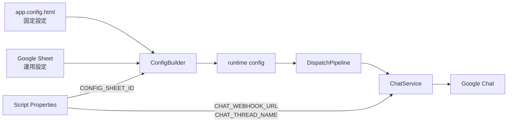
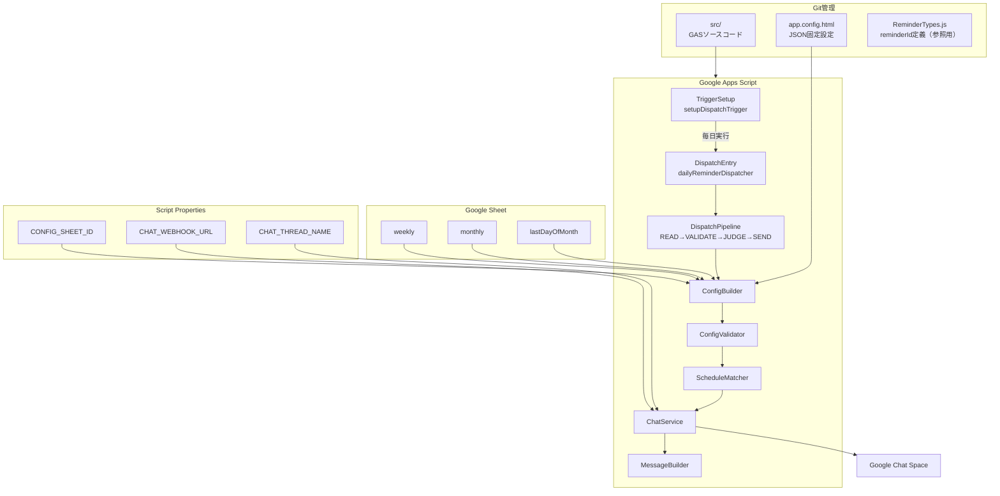
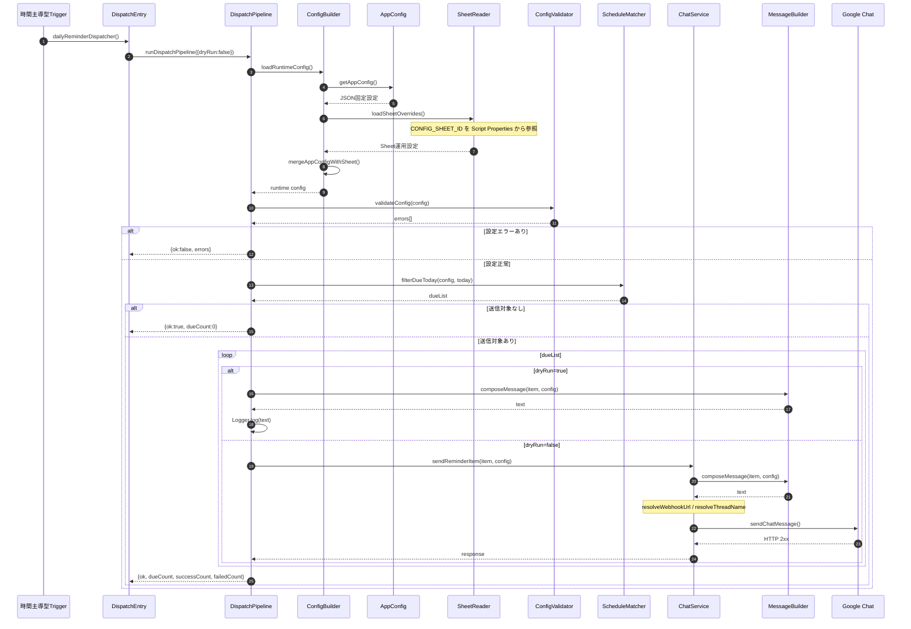
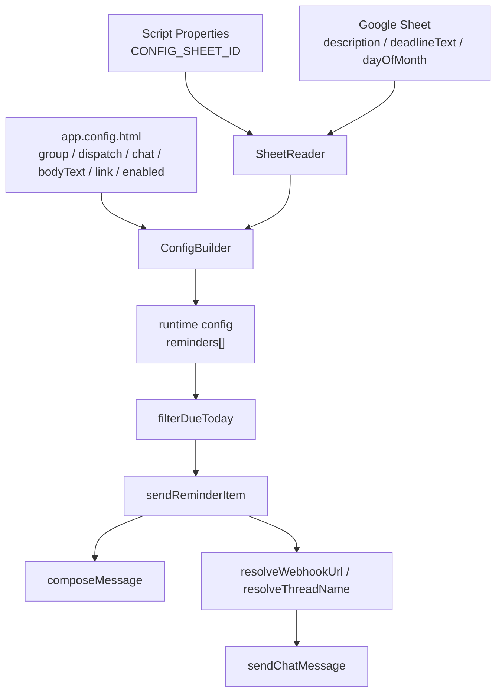

# chatbot-hiroshi-it

Google Chat定期リマインドBot（Google Apps Script + Google Sheet設定）

## ディレクトリ構成

| ディレクトリ | 用途 |
|-------------|------|
| [`src/`](src/README.md) | GASソースコード（clasp push対象） |
| [`config/sheet-schema/`](config/sheet-schema/FIELDS.md) | Sheet項目定義と入力例 |
| [`docs/design/`](docs/design/详细设计文档.md) | 設計ドキュメント |

## クイックスタート

1. `config/sheet-schema/FIELDS.md`に従ってGoogle Sheetを作成する
2. `src/core/app.config.html`で固定設定を編集する
3. Script Propertiesに`CONFIG_SHEET_ID`を設定する
4. 本番環境ではScript Propertiesに`CHAT_WEBHOOK_URL`を設定する
5. `clasp push`を実行する
6. GAS上で`setupDispatchTrigger()`を実行し、Triggerを登録する
7. `dryRunDispatch()`で設定と送信対象を確認する
8. 必要に応じて`sendTestToSpace()`または`sendTestToThread()`で送信確認を行う

## アーキテクチャ概要

```text
app.config.html（JSON固定設定）
+ Google Sheet（運用設定）
+ Script Properties（環境依存値・機密情報）
        ↓
ConfigBuilder
        ↓
runtime config
        ↓
dailyReminderDispatcher
        ↓
Google Chat
````

## 設定の役割分担

### JSON — `src/core/app.config.html`

**単一JSON設定ファイル**です。
拡張子は`.html`ですが、GAS実行時に読み込むための都合であり、中身はJSONとして扱います。

JSON側では、Git管理してよい固定設定を管理します。

| 区分        | 項目                                                 | 説明              |
| --------- | -------------------------------------------------- | --------------- |
| グループ      | groupId, groupName                                 | 識別情報            |
| 配信        | dispatch.hour, dispatch.minute, dispatch.timezone  | 毎日の判定時刻         |
| Chat      | chat.threadName, chat.mentionAll                   | Chat送信のデフォルト設定  |
| 各reminder | enabled, bodyText, linkEnabled, linkUrl, linkLabel | reminderごとの固定設定 |

本番環境の`CHAT_WEBHOOK_URL`はScript Propertiesで管理します。
Git管理対象のJSONには本番Webhook URLを記載しません。

### Sheet — 3タブ

Sheet側では、運用時に変更される項目のみを管理します。

| タブ               | 列                                                 | 対応reminder                                  |
| ---------------- | ------------------------------------------------- | ------------------------------------------- |
| `weekly`         | description, deadlineText                         | weeklyReport                                |
| `monthly`        | reminderId, description, dayOfMonth, deadlineText | documentEarly / documentFinal / reportEarly |
| `lastDayOfMonth` | description, deadlineText                         | reportFinal                                 |

### Script Properties

環境依存値および機密情報はScript Propertiesで管理します。

| キー                 | 説明                      |
| ------------------ | ----------------------- |
| `CONFIG_SHEET_ID`  | 設定用Google SheetのID      |
| `CHAT_WEBHOOK_URL` | Google Chat Webhook URL |
| `CHAT_THREAD_NAME` | 返信先threadName。必要な場合のみ設定 |

## 実行フロー

```text
dailyReminderDispatcher
  → loadRuntimeConfig
  → validateConfig
  → filterDueToday
  → composeMessage
  → sendChatMessage
```

## 補足

### イメージ



### 全体構成図



### 配信処理シーケンス



### 設定合成イメージ


