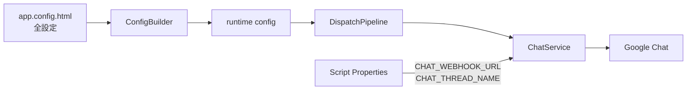
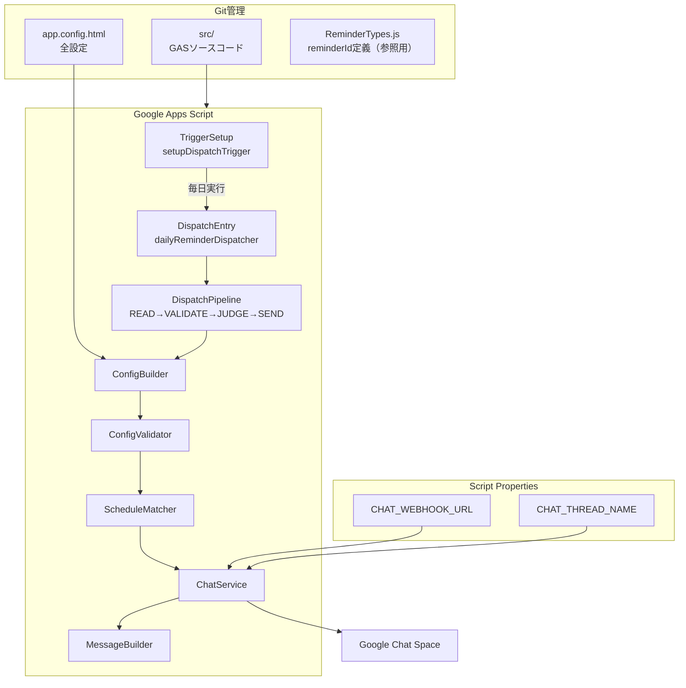
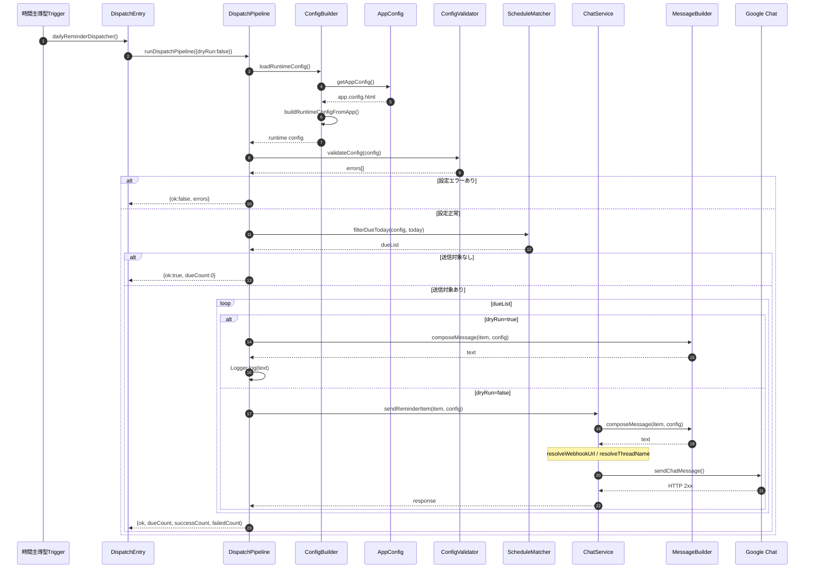
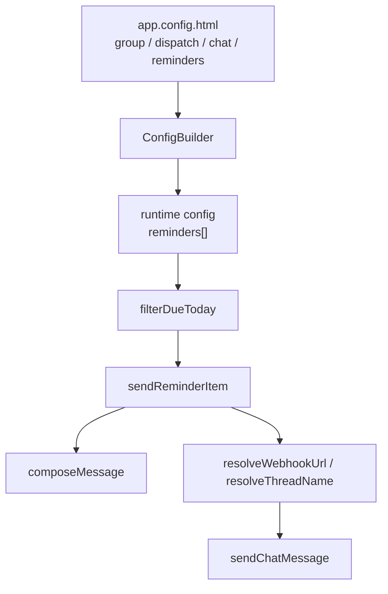

# chatbot-hiroshi-it

Google Chat定期リマインドBot（Google Apps Script + `app.config.html` 設定）

## ディレクトリ構成

| ディレクトリ | 用途 |
|-------------|------|
| [`src/`](src/README.md) | GASソースコード（clasp push対象） |
| [`config/`](config/FIELDS.md) | `app.config.html` 項目定義・改行の書き方 |
| [`docs/architecture/PATH.md`](docs/architecture/PATH.md) | ディレクトリ構成 |
| [`docs/design/详细设计文档.md`](docs/design/详细设计文档.md) | 詳細設計（中国語） |

## クイックスタート

1. `src/core/app.config.html` で文案・日程・配信時刻を編集する
2. 本番環境では Script Properties に `CHAT_WEBHOOK_URL` を設定する
3. `clasp push` を実行する
4. GAS 上で `setupDispatchTrigger()` を実行し、Trigger を登録する
5. `dryRunDispatch()` で設定と送信対象を確認する
6. 必要に応じて `sendTestToSpace()` または `sendTestToThread()` で送信確認を行う

## アーキテクチャ概要

```text
app.config.html（全設定）
+ Script Properties（環境依存値・機密情報）
        ↓
ConfigBuilder
        ↓
runtime config
        ↓
dailyReminderDispatcher
        ↓
Google Chat
```

## 設定の役割分担

### JSON — `src/core/app.config.html`

**単一JSON設定ファイル**です。
拡張子は `.html` ですが、GAS 実行時に読み込むための都合であり、中身は JSON として扱います。

| 区分 | 項目 | 説明 |
| ---- | ---- | ---- |
| グループ | groupId, groupName | 識別情報 |
| 配信 | dispatch.hour, dispatch.minute, dispatch.timezone | 毎日の判定時刻 |
| Chat | chat.threadName, chat.mentionAll | Chat 送信のデフォルト（Webhook は Script Properties） |
| 各 reminder | enabled, description, bodyText, deadlineText, dayOfMonth, linkUrl, linkLabel | reminder ごとの文案・日程 |

本番環境の `CHAT_WEBHOOK_URL` は Script Properties で管理します。
Git 管理対象の JSON には本番 Webhook URL を記載しません。

週報の送信曜日（金曜）はコード固定（`WEEKLY_REPORT_DAY_OF_WEEK`）で、JSON からは変更できません。

#### 改行（`bodyText` など）

JSON 文字列内の **`\n`** は、パース後に実際の改行文字になる。

- **`bodyText`**：`parseBodyTextLines` で行分割され、Google Chat で複数行表示される（推奨）
- **`linkLabel` / `deadlineText`**：1 行想定。`\n` ではリンク表示名の改行にはならない

詳細は [`config/FIELDS.md`](config/FIELDS.md) を参照。

### Script Properties

環境依存値および機密情報は Script Properties で管理します。

| キー | 説明 |
| ---- | ---- |
| `CHAT_WEBHOOK_URL` | Google Chat Webhook URL |
| `CHAT_THREAD_NAME` | 返信先 threadName。必要な場合のみ設定 |

## 実行フロー

```text
dailyReminderDispatcher
  → loadRuntimeConfig
  → validateConfig
  → filterDueToday
  → sendReminderItem
  → sendChatMessage
```

## 補足

### イメージ



### 全体構成図



### 配信処理シーケンス



### 設定生成イメージ


